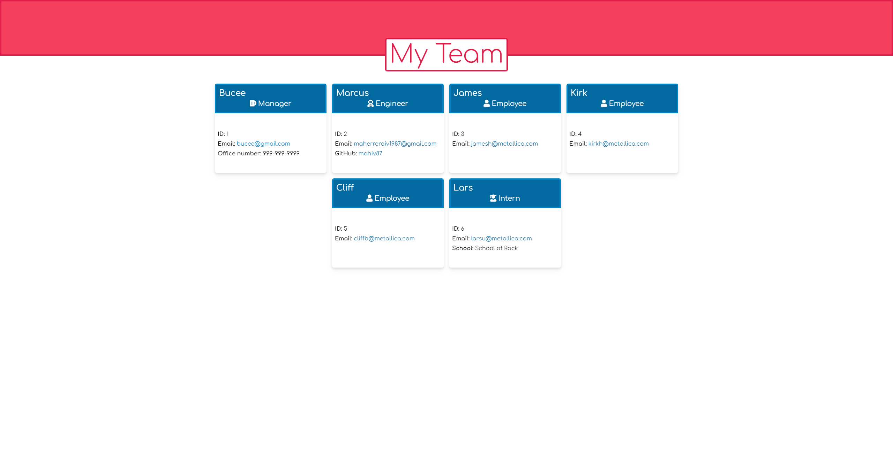

# Team Profile Generator

## Table of Contents
- [Description](#description)
- [Technologies](#technologies)
- [Installation](#installation)
- [Usage](#usage)
- [License](#license)
- [Contributing](#contributing)
- [Tests](#tests)
- [Questions](#questions)
- [Screenshot](#screenshot)

## Description

[Link to video demonstration](https://drive.google.com/file/d/1wzZEqR84ntb-dssJblkzcJYgao9QB8dV/view?usp=sharing)

TPG dynamically creates cards with info of each member on your team

## Technologies

- HTML5
- CSS3
- JavaScript
- Node.js
- Tailwind

## Installation

To install - clone this repository, then run "npm i" in the terminal to install all dependicies

## Usage

Run "node index" in the terminal to envoke the app. You will be asked a series of questions about you, and your team members. After all questions are answered, your Team Profile will be generated in the "dist" folder.

## License

Permission is hereby granted, free of charge, to any person obtaining a copy of this software and associated
documentation files (the "Software"), to deal in the Software without restriction, including without limitation the rights
to use, copy, modify, merge, publish, distribute, sublicense, and/or sell copies of the Software, and to permit persons to 
whom the Software is furnished to do so, subject to the following conditions:

The above copyright notice and this permission notice shall be included in all copies or substantial portions of the Software. 

THE SOFTWARE IS PROVIDED "AS IS", WITHOUT WARRANTY OF ANY KIND, EXPRESS OR IMPLIED,
INCLUDING BUT NOT LIMITED TO THE WARRANTIES OF MERCHANTABILITY, FITNESS FOR A PARTICULAR
PURPOSE AND NONINFRINGEMENT. IN NO EVENT SHALL THE AUTHORS OR COPYRIGHT HOLDERS BE LIABLE
FOR ANY CLAIM, DAMAGES OR OTHER LIABILITY, WHETHER IN AN ACTION OF CONTRACT, TORT OR
OTHERWISE, ARISING FROM, OUT OF OR IN CONNECTION WITH THE SOFTWARE OR THE USE OR OTHER
DEALINGS IN THE SOFTWARE. See more here [MIT](https://opensource.org/licenses/MIT)

## Contributing 

Name and Github link

## Tests

To test the app - run "npm test (class)" in the terminal

## Questions

You can submit any questions to:

[GitHub](https://github.com/mahiv87)

maherreraiv1987@gmail.com

## Screenshot

